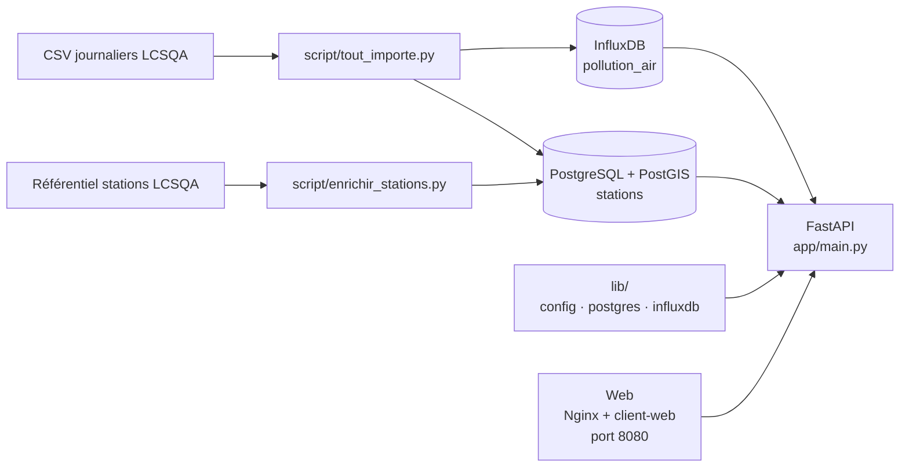
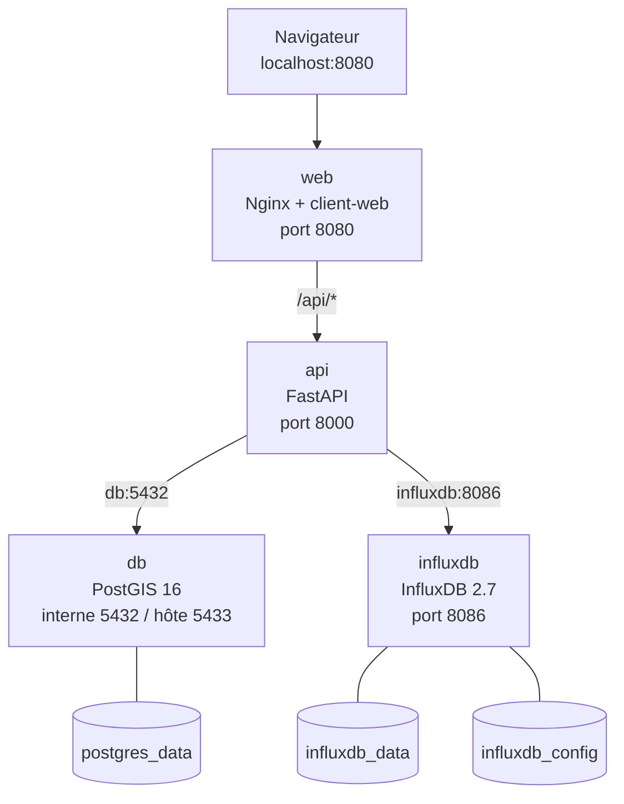
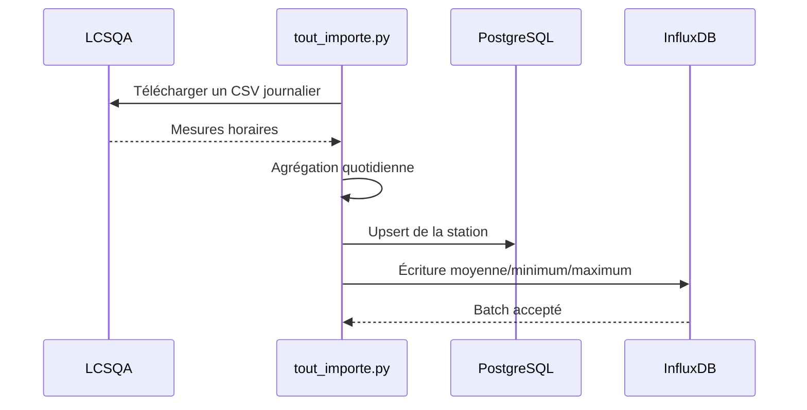
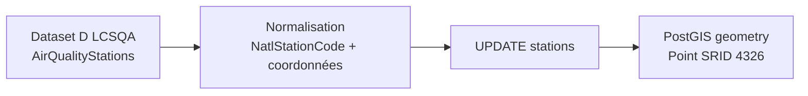
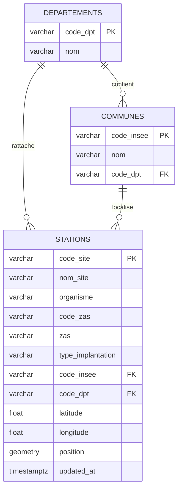
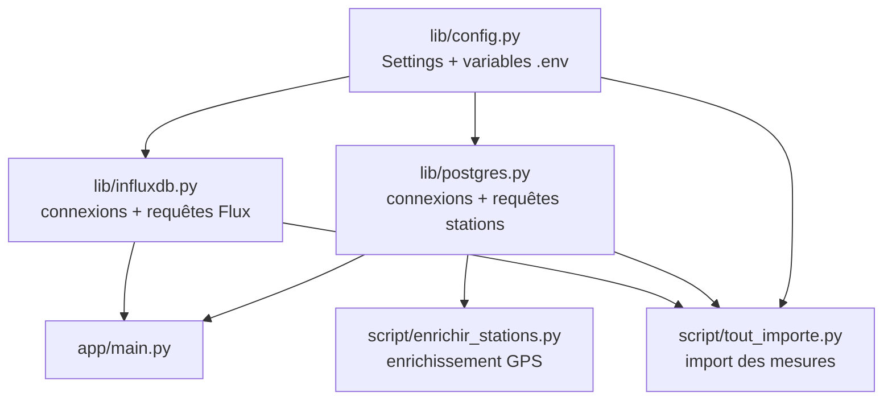

# Ecoterritoire

## 1. Vue d'ensemble

Ecoterritoire est un dashboard de qualité de l'air en France. Les deux bases ont des responsabilités différentes :

- **InfluxDB** stocke les mesures de pollution et leurs agrégations temporelles.
- **PostgreSQL/PostGIS** stocke les stations, leurs métadonnées et leurs coordonnées géographiques.
- **FastAPI** interroge les deux bases et expose les données au dashboard.
- **HTML/CSS/JavaScript** affiche la carte, la synthèse et la timeline.



## 2. Services Docker



Services définis dans [docker-compose.yml](../docker-compose.yml) :

| Service | Rôle | Accès depuis l'hôte |
|---|---|---|
| `api` | API FastAPI | `http://localhost:8000` |
| `web` | Dashboard statique + reverse-proxy | `http://localhost:8080` |
| `db` | PostgreSQL avec PostGIS | `localhost:5433` |
| `influxdb` | Base de séries temporelles | `http://localhost:8086` |

Les bases utilisent des volumes Docker persistants. Le schéma PostgreSQL est intégré dans l'image définie par [docker/postgres/Dockerfile](../docker/postgres/Dockerfile).

## 3. Flux d'importation

### Mesures de pollution

Le script [script/tout_importe.py](../script/tout_importe.py) :

1. génère les dates à importer à partir de `IMPORT_YEARS` ;
2. télécharge les CSV LCSQA journaliers ;
3. convertit les dates et les valeurs ;
4. agrège les mesures par jour, station et polluant ;
5. écrit les points dans InfluxDB ;
6. synchronise les métadonnées de station dans PostgreSQL.



### Coordonnées GPS

Le script [script/enrichir_stations.py](../script/enrichir_stations.py) télécharge le référentiel officiel LCSQA Dataset D et joint les lignes par `NatlStationCode`, identique au `code site` utilisé dans les CSV de mesures.



Commandes principales :

```bash
# Démarrer les services
docker compose up -d --build

# Importer les mesures
docker compose run --rm api python script/tout_importe.py

# Enrichir les stations avec les coordonnées GPS
docker compose run --rm api python script/enrichir_stations.py
```

## 4. Modèle de données

### PostgreSQL/PostGIS



La table `stations` est définie dans [sql/script_postgres.sql](../sql/script_postgres.sql). Le champ `code_site` est la clé de rapprochement entre PostgreSQL et InfluxDB.

Les champs `code_insee`, `code_dpt` et les relations administratives sont prêts, mais leur alimentation dépend d'une source géographique complémentaire au référentiel des coordonnées.

### InfluxDB

- **Bucket** : `qualite-air`
- **Measurement** : `pollution_air`
- **Timestamp** : jour d'agrégation, en UTC
- **Clé de station** : tag `code site`
- **Polluant** : tag `Polluant`

```text
pollution_air
├── tags
│   ├── code site
│   ├── nom site
│   ├── Polluant
│   ├── Organisme
│   ├── code zas
│   └── autres métadonnées LCSQA
└── fields
    ├── moyenne
    ├── minimum
    ├── maximum
    └── nombre_mesures
```

## 5. Librairie Python partagée

La librairie [lib](../lib) est utilisée par FastAPI et par les scripts d'importation pour éviter de disperser les détails de connexion et de requête.



Les scripts utilisent donc la même couche d'accès que l'API :

- `tout_importe.py` utilise `lib.config`, `lib.influxdb.get_client`, `lib.influxdb.get_write_api` et `lib.postgres.upsert_stations` ;
- `enrichir_stations.py` utilise `lib.postgres.update_station_coordinates`.

Variables principales :

```text
DATABASE_URL
INFLUXDB_URL
INFLUXDB_TOKEN
INFLUXDB_ORG
INFLUXDB_BUCKET
INFLUXDB_MEASUREMENT
STATION_METADATA_URL
IMPORT_YEARS
```

## 6. Routes principales

### Santé et frontend

| Méthode | Route | Description |
|---|---|---|
| `GET` | `/` sur le service `web` | Sert le dashboard HTML |
| `GET` | `/health` | Vérifie PostgreSQL et InfluxDB |
| `GET` | `/docs` | Documentation Swagger FastAPI |

### Stations et référentiels

| Méthode | Route | Paramètres | Description |
|---|---|---|---|
| `GET` | `/stations` | `code_site`, `code_dpt` | Liste les stations PostgreSQL/PostGIS |
| `GET` | `/pollutants` | aucun | Liste les polluants présents dans InfluxDB |

### Pollution

| Méthode | Route | Paramètres | Description |
|---|---|---|---|
| `GET` | `/pollution/map` | `day`, `pollutant` optionnel | Retourne les stations et les valeurs du jour |
| `GET` | `/pollution/summary` | `day`, `pollutant` optionnel | Retourne moyenne, minimum, maximum et stations |
| `GET` | `/pollution/timeline` | `start`, `stop`, `pollutant`, `code_site` | Retourne les valeurs quotidiennes |
| `GET` | `/measurements` | `start`, `stop`, `pollutant`, `code_site` | Alias simplifié de la timeline |

Exemples :

```text
GET /stations
GET /pollutants
GET /pollution/map?day=2025-01-02
GET /pollution/map?day=2025-01-02&pollutant=NO2
GET /pollution/summary?day=2025-01-02
GET /pollution/summary?day=2025-01-02&pollutant=PM10
GET /pollution/timeline?start=2025-01-01&stop=2025-01-31&pollutant=NO2
```

### Réponse cartographique

Quand un polluant précis est demandé, la réponse contient une valeur directement comparable entre les stations :

```json
{
  "code_site": "FR01011",
  "latitude": 49.119442,
  "longitude": 6.180833,
  "pollutant": "NO2",
  "value": 18.4
}
```

Quand tous les polluants sont demandés, l'API calcule un `map_index` relatif entre `0` et `100`. Chaque polluant est normalisé séparément avant la combinaison des scores, afin de ne pas comparer directement des unités différentes :

```json
{
  "code_site": "FR01011",
  "latitude": 49.119442,
  "longitude": 6.180833,
  "measurement_count": 5,
  "pollutants": ["NO", "NO2", "O3"],
  "map_index": 34.6
}
```

## 7. Frontend

Le frontend est volontairement sans framework :

- [client-web/index.html](../client-web/index.html) : structure du dashboard ;
- [client-web/style.css](../client-web/style.css) : mise en page et états visuels ;
- [client-web/app.js](../client-web/app.js) : appels API, Leaflet, carte et timeline.

La timeline est l'unique contrôle temporel. Elle change la date observée entre le 1er janvier et le 31 décembre 2025 et recharge la carte et la synthèse du jour. Nginx sert ces fichiers séparément de FastAPI et relaie les appels `/api/*` vers l'API.

La carte affiche :

- toutes les stations géolocalisées ;
- une couleur verte, orange ou rouge quand un indice comparable est disponible ;
- un point gris lorsqu'aucune mesure n'est disponible ;
- un popup avec le détail de la station.

## 8. État actuel et prochaines évolutions

- Les mesures 2025 sont importées dans InfluxDB.
- Les stations et leurs coordonnées GPS sont présentes dans PostgreSQL/PostGIS.
- Les frontières administratives des communes, départements et régions ne sont pas encore chargées.
- Les couleurs actuelles sont relatives et ne constituent pas encore un indice réglementaire.
- Une prochaine étape naturelle est d'ajouter les contours GeoJSON et une agrégation par département ou région.
